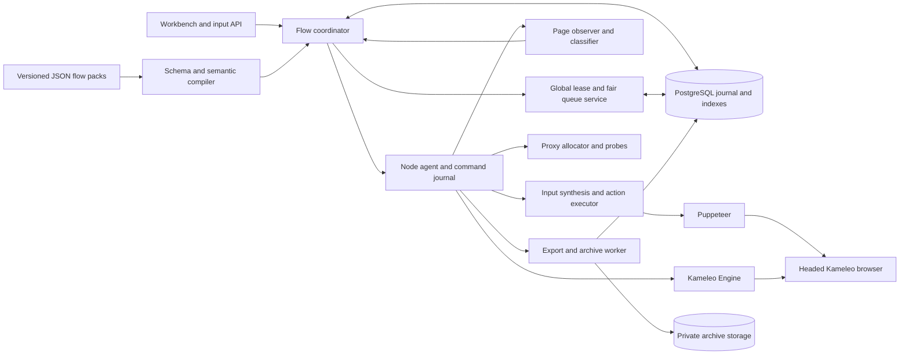
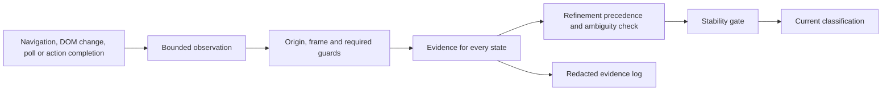
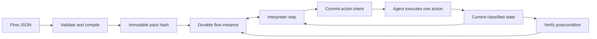
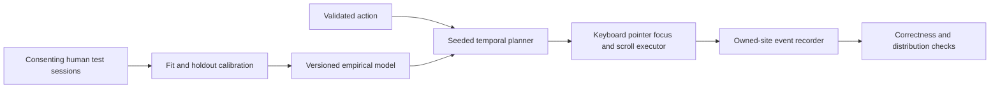
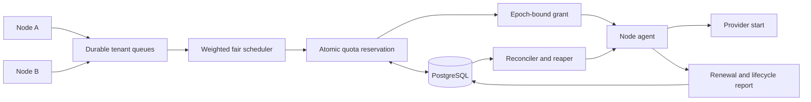
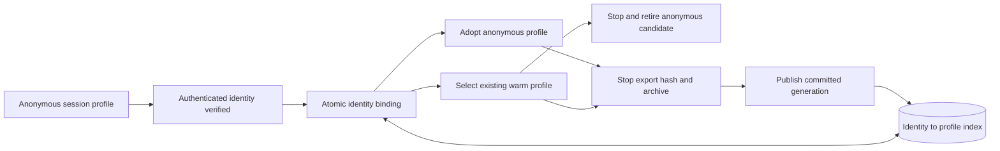
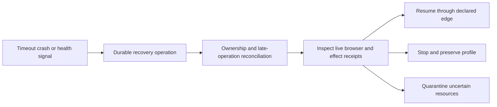

# Kameleo Workbench architecture

Updated 2 October 2026. This document covers the shipped runtime and the target contracts for extending it. The state recognizer, finite flow interpreter, interaction executor, PostgreSQL coordinator and single-node managed runtime are implemented. Distributed isolation, remote archive storage and several recovery adapters remain deployment work. A listed race, failure or capacity test is an acceptance requirement unless the [validation record](../validation.md) records an actual result. Examples use owned sites and synthetic accounts.

The main change is to make the browser's observed state, the flow's durable progress, and the right to operate a profile three separate things. None can safely stand in for the other. A saved instruction pointer does not establish what a page now shows; an expired lease does not establish that a browser has stopped; and a successful click call does not establish that a submission succeeded.

Managed mode combines a PostgreSQL coordinator, a worker beside each Kameleo Engine, a constrained flow interpreter and packs pinned by content hash. Script mode remains a separate interface for trusted Puppeteer modules. The modes share the administrator workbench; only managed flows use the declarative action journal and coordinator lease protocol.

| Area | Shipped behavior | Remaining work |
| --- | --- | --- |
| Ownership | PostgreSQL lease epochs, node advisory lock, bounded authorization and quarantined uncertain operations | A separate node-agent security boundary, infrastructure fencing and multi-node failure qualification |
| Profiles and archives | Verified identity binding, local warm reuse, local immutable exports, checksum verification and generation publication | Automatic cross-node restore, encrypted object-store uploads and replica cleanup |
| Retention | Expired inactive input-envelope cleanup and coordinator tombstones | Scheduled profile/archive retention and a complete purge service |
| Recovery | Bounded calls, durable journals, same-node restart reconciliation and operator resume | An external managed-worker watchdog, OS process/lock adapters and automatic mid-session proxy replacement |
| Served assets | Content-hashed bundles, atomic local writes and retained bundle generations | Build-ID/API-version negotiation with old clients |
| Interaction | Seeded synthesis, recording, calibration and scoring tools | Consented human measurements, fitted defaults and held-out validation |

| Concrete artifact | Contents |
| --- | --- |
| [State registry schema](../../schemas/state-registry.schema.json) | Maintained Draft 2020-12 definitions for targets, URL/DOM/text predicates, guards, evidence, refinement and stability policy |
| [Flow pack schema](../../schemas/flow-pack.schema.json) | Maintained actions, scrape/bind operations, input/choice states, branches, errors, deadlines and retry policies |
| [Owned-site example](examples/owned-site.flow.json) and [deployment manifest](examples/owned-site.manifest.json) | A complete fixture definition with separately trusted origins and installed policy/resolver names |
| [Coordination schema](schemas/coordination.sql) | Concrete PostgreSQL lease records, identity index/aliases, bindings, anonymous session attachments, flow/action journals and archive generations; transaction obligations at the end |
| [Interaction model](interaction-model.md) | Distributions, corrections, pointer/focus/scroll planning, calibration and held-out scoring |
| [Capacity model](capacity-model.md) | 8-vCPU/32-GiB sizing assumptions, sessions/day and N-node bottlenecks |
| [Format validator](validate.mjs) | Standalone checks for the original example artifacts; runtime compilation is in `src/flows/compiler.ts` |
| [Design validation record](validation.md) | Original schema/SQL checks and links to implementation validation |

## Components and existing integration points



| Code | Responsibility |
| --- | --- |
| `src/runtime.ts`, `src/run-worker.ts` | Existing trusted-script lifecycle and process isolation; interrupted scripts are not replayed. |
| `src/flows/` | Pack compiler, bounded main-frame observations, classifier, guarded browser adapter and journal-driven interpreter. |
| `src/interaction/` | Seeded input planner, guarded native executor, consented synthetic-task recorder and calibration/scoring tools. |
| `src/coordinator/` | PostgreSQL transactions, ownership grants, quotas, identity binding, operation records and archive generations. |
| `src/managed/` | Node ownership, Engine lifecycle, input vault, flow execution and coordinator integration. |
| `src/engine.ts`, `src/proxies/` | Kameleo adapter, provider credential construction, bounded probes and process-local proxy reservations. |
| `src/server.ts`, `public/` | Administrator API, live display, challenges, observed flow state and recovery status. |

The deployed managed runtime runs the interpreter and Engine adapter in one process. It uses a PostgreSQL node advisory lock, checks lease authorization before further input, journals lifecycle operations and persists a local observation sequence. Losing the lock aborts active sessions. This is not an independent agent or an infrastructure fence: a database token cannot retract a CDP command already dispatched by a paused process.

The target distributed boundary confines Engine control, debugging endpoints and profile files to a separate node agent. That agent must serialize lifecycle and input commands, persist the highest accepted ownership epoch, and close old channels before accepting a new owner. A takeover must retain uncertain capacity until the old process is proven stopped or externally fenced. Raw scripts run in a separate deployment mode and retain their documented recovery limits.

Managed lifecycle records and stop barriers address a gap in profile-name discovery: a lookup that finds no profile cannot prove an earlier create request will never finish. Keep the reservation until that operation is resolved. Script mode retains its earlier recovery path and does not inherit managed-mode guarantees merely by sharing the workbench UI.

For multiple tenants, a shared desktop/VNC display is not isolation: it can show other windows. Use one tenant per Engine/display boundary initially, or provide a reviewed per-session display relay. Keep archive authorization, node credentials, input requests and evidence tenant-scoped. A tenant boundary is separate from Kameleo's provider team/account quota.

## 1 Live page state recognition



The implementation binds one observation stream to the selected Puppeteer Page and main frame. Samples include a document epoch, sequence and timestamps. Main-frame navigation and document changes revoke old evidence; the executor also retains and checks actual document/element handles. The interpreter polls at the pack's bounded sampling interval and observes before and after actions. DOM-event-driven scheduling is a later optimization; the current implementation does not depend on a quiet mutation stream.

The observer evaluates the target inventory and predicates in one bounded browser call. It returns origin/path and predicate outcomes; raw text used for a comparison stays in the page. The schema supports the selected page's main frame. Frame support needs an explicit origin/epoch binding. Read failures are unknown evidence. Inaccessible frames, closed shadow DOM and canvas-only applications need a separate adapter.

The concrete format is [state-registry.schema.json](schemas/state-registry.schema.json). Its classifier must apply these rules independently of array order:

1. Reject disallowed origins, wrong document/frame scope, failed required predicates, and matched exclusion predicates.
2. Score all remaining states from their declared evidence. Require a structural or route guard for actionable states; broad words alone cannot authorize input.
3. Apply the acyclic `refines` relation: a qualifying specific state suppresses its qualifying generic ancestor. Numeric priority, expected transitions and previous state never override missing evidence or resolve unrelated ambiguity.
4. An unresolved overlap between incomparable states produces `unknown/ambiguous`. Do not use alphabetical IDs or the first array item as a safety decision.
5. Admit a winner only after its stability requirement. Any hard guard or safety-blocker change revokes the old actionable state immediately.

For example, a verification-error page can contain both “Verify your account” and “Code expired.” Matching `verification_form` first by its heading would submit into an error state. Define `verification_expired` as a refinement, require its visible error marker, and suppress the generic form. Lint the relation for cycles and test intersections with fixtures. DOM specificity cannot be reliably inferred by simply counting selectors or words.

Use `evidenceScore = sum(matchedWeight) / sum(configuredWeight)` for support evidence after guards; missing optional evidence contributes zero. An empty support list scores 1 only when all required guards passed. A failed guard excludes the state regardless of score. It is a ranking score, not an 85% probability merely because it equals 0.85. Calibrate thresholds per state using labeled owned-site snapshots, including adversarial overlaps and partial renders. Keep a separate estimated precision and calibration version if enough holdout data exist; otherwise report that probability as unavailable. Seed policy: threshold 0.85, two consistent observations at least 150 ms apart, and a 1.5 s render-grace window. These are initial design settings to tune, not measured optimal values; the included fixture pack supplies its own stricter settings. `unknown` is a reserved runtime state and cannot be overridden by a pack.

During a blank or partial render, return `{state: "unknown", reason: "rendering", actionable: false, lastStableState}`. The UI may continue showing the last stable label with a “rendering” indicator for up to 1.5 s, but no old state action is allowed. The grace timer starts at the first incomplete observation and cannot reset forever on DOM churn. At expiry show ordinary unknown; after a 10 s unknown-state budget, park for inspection. Unexpected origins and explicit fatal markers bypass render grace. This avoids label flapping without executing against stale content.

The classifier returns all states' local guard outcomes, inherited-state references, qualification, support scores and suppressing descendants. Recognition transition events carry that bounded evidence summary with safe state/step/action IDs and reason codes. The authenticated evidence endpoint reads the coordinator events. No matched text, OTPs, full page bodies or URL queries are included. Automatic screenshots are disabled. The following illustrates the diagnostic concepts; the exact runtime fields are in `StateEvidence` and `FlowEvent`:

```json
{
  "observationSeq": 42,
  "documentEpoch": 7,
  "state": "verification_expired",
  "actionable": true,
  "evidenceScore": 1,
  "calibratedPrecision": null,
  "candidates": [
    {"id": "verification_form", "score": 1, "suppressedBy": "verification_expired"},
    {"id": "verification_expired", "score": 1, "rules": [
      {"id": "expired-marker", "result": "matched", "weight": 3},
      {"id": "verification-route", "result": "matched", "weight": 2}
    ]}
  ]
}
```

```text
classify(session, trigger):
  revoke_previous_action_permission(session)
  observation = bounded_snapshot(session.target, session.document_epoch)
  if observation.epoch_changed_during_capture: return UNKNOWN("unstable_capture")
  if forbidden_origin(observation): return UNKNOWN("origin_blocked")
  evidence = evaluate_every_registered_state(observation)
  candidates = guarded_candidates_above_threshold(evidence)
  candidates = suppress_qualified_ancestors(candidates)
  winner = resolve_only_declared_unambiguous_precedence(candidates)
  append_redacted_evidence(observation, evidence, winner)
  if not winner or not stable(winner, observation):
    return UNKNOWN(reason, last_stable_for_display_only)
  return current_result(winner, epoch, seq, short_expiry, actionable=true)
```

## 2 Declarative flow packs

A site definition is immutable JSON conforming to [flow-pack.schema.json](../../schemas/flow-pack.schema.json). The loader accepts JSON only. It pins a SHA-256 over the parsed pack and trusted manifest in every flow instance; object-key ordering therefore affects the current hash. Schema version and pack version are distinct. An in-flight instance cannot silently adopt an edited pack.

The compiler checks references, unique IDs, refinement cycles, action reachability, branch completeness, finite budgets, retry classifications and origins. Unknown keys are rejected. Values reference named inputs, answers or captures; there are no expressions. Choice patterns use a restricted anchored syntax with literal prefixes/suffixes and at most one repeated simple character class. A pack chooses installed policy IDs and cannot supply executable hooks. `identityPolicy` distinguishes anonymous completion from verified identity completion, and cannot weaken the trusted manifest.



The flow snapshot pins the pack hash and stores step/attempt counters, timestamps, status and pending intent. Pending phases are `intent`, `dispatched` and `uncertain`; confirmed outcomes advance the step and clear the pending record. The coordinator separately binds that flow to a lease, node and profile generation. Managed input storage is encrypted outside the checkpoint. Answers, scraped values and identity receipts are ephemeral and must be reacquired after restart. The original relational contract remains in [coordination.sql](schemas/coordination.sql); executable migrations live under `src/coordinator/migrations/`.

Actions include fill, click, wait, scrape, choose, request input, bind identity and finish. Each has preconditions, a bounded deadline, postconditions and a replay policy. Execute one action at a time. A fill-and-click sequence must reobserve after the fill; even internal typing pauses if navigation/focus changes. Filling a field also requires an ephemeral exact-value readback; remaining on the same page is not proof that the right text was entered. Do not log that value. Per-state entry actions have durable visit-scoped action IDs so a polling loop cannot repeat them. State time budgets do not reset every poll or restart.

Freshness checks narrow the gap between observation and dispatch but cannot lock a remote DOM against changes. Recheck the intended element, hit target and epoch at dispatch, then verify the result. For consequential owned-site actions, an application-side operation token and receipt provide stronger guarantees than browser geometry alone.

Treat transitions as allowed observations, not commands to believe. The page may reach a later state through a redirect, warm session, operator action or delayed submission. A declared resume edge can adopt a reachable later state only if its semantic guards and required business postconditions hold. Earlier states need an explicit bounded recovery edge. Unlisted out-of-order states park the flow. Do not numerically “skip to step 6” because its heading is present. Recognized errors have dedicated variants and policy: retriable rendering/network errors, user-correctable input, exhausted options and terminal business refusal.

Restart recovery acquires exclusive flow ownership, fences the old agent channel, resolves pending commands, then observes the live page. Reattach to an owned live browser where possible; otherwise restore its last verified profile generation on a compatible node. Resume from observed state plus confirmed effects, not from the last line of code. A submission with an unknown outcome queries our site's operation ledger by idempotency key. If the site lacks such a receipt, park for inspection. Exactly-once effects are only possible with the application's cooperation; journaled browser input alone cannot guarantee them.

```text
interpreter_step(flow_id):
  f = load_and_claim_flow(flow_id)             # owner epoch and pinned pack
  require_valid_agent_and_profile_ownership(f)
  if pending_command(f):
    outcome = reconcile_agent_command_and_site_receipt(f)
    if still_uncertain(outcome): persist_bounded_review(f); return
    f = reload_reconciled_flow_under_same_owner(f)
  observed = classify(f.session, "before_action")
  if review_required(f, observed): publish_diagnostics_and_persist_review_deadline(f); return
  if not observed.actionable: persist_wait_or_deadline_failure(f); return
  edge = resolve_allowed_transition(f, observed, durable_effects(f))
  if not edge: park("unexpected_state"); return
  action = next_unconfirmed_action_for_visit(f, edge)
  if not action: persist_transition_or_terminal(f); return
  validate_fresh_target_preconditions(action, observed)
  intent = commit_unique_intent(f.version, f.epoch, observed.epoch, action)
  result = agent.execute(intent, deadline, idempotency_key_if_supported)
  after = classify(f.session, "after_action_or_timeout")
  if definite_postcondition(action, after, site_receipt): confirm_and_advance(intent)
  else if outcome_may_have_happened(result): mark_uncertain_and_reconcile(intent)
  else: take_explicit_bounded_error_edge_or_park(intent)
```

### Choice list states

Scrape options from the current visible list root using stable option keys supplied by our application, display labels, disabled/hidden status and declared availability attributes. The concrete pattern registry maps exact keys or a bounded anchored key-pattern subset to named types. Validate patterns independently of array order and reject ambiguity instead of taking the first match. This initial dialect deliberately uses our site's stable option keys; translated label inference would require an explicit schema extension and locale fixtures. A familiar keyword elsewhere in a row is insufficient. Availability and support are separate fields.

Present only options that are recognized, implemented, enabled and currently available. Keep excluded counts and reasons in the evidence log. Send the UI an opaque choice token bound to the flow, document epoch, options digest and expiry. On selection, rescrape and revalidate the same stable key, supported type and availability before clicking. Never replay a stale array index or selector from the client. Duplicate keys, changed option type or a stale digest require a fresh choice list.

Distinguish an empty list that is still loading, all-known options unavailable, all options unsupported, and an ambiguous list. Each has a named diagnostic outcome. The initial schema routes all-unavailable into a bounded review step; its recovery edges can request a freshly scraped list after review, and its deadline ends the wait while preserving the profile. Later schema versions can add automatic fallback, bounded refresh or terminal `no_available_option` policies. None may spin forever or quietly select an unsupported option. The operator chooses only allowlisted supported types. A returning flow re-presents an expired choice rather than consuming an old answer.

The [owned-site example](examples/owned-site.flow.json) runs against the optional local fixture in `src/fixture.ts`. Its selectors are an owned application contract; external integrations need their own registries and resolver policies.

## 3 Interaction synthesis

The input model is for repeatable, realistic interaction testing on our applications. It must preserve correctness, user control and observability. Human-like timing is not a claim that a session is indistinguishable from a human, and the validation score must not be trained against third-party anti-abuse gates.



Detailed parameters, calibration and event semantics are specified in [interaction-model.md](interaction-model.md). Runtime requirements are: monotonic timing, a stored random seed/model version for reproduction, cancellation checks between events, actual event timestamps in the validation harness, and reclassification at action boundaries. Revalidate focus, document epoch and target connectivity during long input. Stop rather than typing the remaining text into a newly focused field.

Keep separate fast functional and empirical interaction modes. Do not label a global speed multiplier as simultaneously “ultra fast” and human-distributed: compressing timings changes the target distribution. A low-latency human model must be fitted to that actual subgroup and assessed as such. Disable synthetic mistakes for passwords, OTPs, payment fields and any field whose incorrect values create side effects. Natural focus order and scrolling must follow actual layout and tab order, not add decorative randomness.

The DOM standard defines `isTrusted` around event creation/dispatch, not human identity. Script-created `dispatchEvent` events are untrusted; browser input paths and their event sequences must be measured for the pinned engine. Puppeteer's `sendCharacter` differs from a key down/up sequence, and its `type` timing option is not a fitted digraph model. [DOM event semantics](https://dom.spec.whatwg.org/#dom-event-istrusted), [Puppeteer character input](https://pptr.dev/api/puppeteer.keyboard.sendcharacter), [Puppeteer typing](https://pptr.dev/api/puppeteer.keyboard.type).

For compatibility, use documented keyboard and pointer primitives, preserve composition and input semantics, and version-test event traces on our recorder page. For our application's automation controls use explicit test credentials, test-mode policy or supported automation endpoints. Do not patch `isTrusted`, hide debugging artifacts or claim that timing removes CDP visibility. An input model cannot guarantee real OS user activation, hardware input provenance, IME behavior or absence of automation-framework artifacts.

## 4 Global profile lease coordinator

Kameleo documents browser and counted API quotas as shared per provider team. Mobile starts also consume the total-browser quota. Account/user restrictions returned by `GetUserInfo` should be treated as additional dimensions when present. Counted API operations include fingerprint search, profile creation and profile start; storing a stopped profile does not consume a running slot. Read these limits at deployment and reconcile them over time instead of hardcoding a subscription plan. [Provider usage limits](https://developer.kameleo.io/reference/usage-limits/).

The provider documents lag and differences between local counts and provider accounting, with slots accounted during start/stop and eventual release after lost Engine connectivity. Those counters are observations, not atomic admission or proof that local processes are dead. [Concurrent-browser tracking](https://help.kameleo.io/article/115-concurrent-browsers).



An acquire request is idempotent by `(quotaDomain, tenant, requestId)`. `quotaDomain` means the canonical Kameleo team/subscription shared by every member, PAT and installation; it never means one login or token. References below to account-level locks and cooldowns use this same domain. Apply any extra user restriction beneath it. The schema stores finite operator admission budgets; an unlimited provider value does not mean unbounded node resources. A reservation counts in every applicable quota before dispatching start. Count reserved, starting, active, draining, suspect and quarantined work until reconciled; the SQL represents charged capacity by an unset `capacity_released_at`, independently of its narrower lease status enum. Acquisition also needs node CPU/RAM capacity, profile exclusivity and a proxy lease; coordinate reservations without holding a database transaction across external work. Unstarted reservations may be cancelled only after proving no agent command was dispatched. No worker decrements a counter merely because its RPC timed out.

Use short PostgreSQL transactions and explicit per-account quota-row locks in a canonical order. Uniqueness constraints protect request IDs and profile holders. A leader chooses tenant grants, but correctness comes from the database, not leader memory. Retry transaction conflicts before sending external commands. If using Serializable instead, all relevant writers must use it and retry serialization failures. [PostgreSQL transaction isolation](https://www.postgresql.org/docs/current/transaction-iso.html).

The service is strongly consistent for its own grants while the database primary is available; provider accounting is eventually observed. Use a single writable primary with protected failover. If a failover might lose acknowledged commits, freeze admission and reconcile every surviving agent/profile before reopening. Asynchronous replica failover plus optimistic lease reuse is not safe. If the central service dies, queued sessions stay queued; agents stop accepting new actions when their grant cannot be renewed and begin draining. A node uses a conservative monotonic deadline derived from a lease duration measured from renewal-request send time, never a freshly reset full TTL on delayed response. Seed values: renew every 10 s, 45 s grant, stop input before expiry, and 30 s stop timeout. Validate these under event-loop stalls and VM pauses.

The provider does not expose our fencing epochs. Therefore a disconnected or paused node can remain uncertain even after grant expiry. Epochs fence the node-agent command channel; takeover may also require confirmed termination of the old Engine isolation unit, or an equivalent infrastructure fence that prevents both execution and mutable storage access. A firewall rule alone does not prove browser death, stop local writes or undo a website effect already accepted. Prefer availability loss to running two copies of one identity. Local profile mutexes, browser slots and proxy leases stay reserved through uncertainty. A confirmed stopped browser can release its running slot while export continues under the exclusive profile lock.

Weighted deficit round-robin with FIFO per tenant gives fair eligible grants; include aging, tenant concurrent limits and a bounded bypass for temporarily ineligible requests. Track browser-seconds so a tenant cannot dominate through long leases; do not preempt a non-idempotent action to improve fairness. Report `waiting_tenant_turn`, `waiting_provider_capacity`, `waiting_node`, `waiting_proxy`, `waiting_profile`, `reconciling` and deadline expiry separately. Fair grant order cannot promise a strict maximum wait when other work has unbounded duration, so every flow has a maximum lease duration and explicit human-wait budget.

On provider capacity rejection (`running_profiles_limit_reached` or `running_mobile_profiles_limit_reached`), confirm that no profile started, resolve the reservation, preserve queue age and retry with full jitter `U(0, min(30 s, 500 ms * 2^attempt))`. Set an account-level cooldown so all nodes do not retry independently. Respect bounded `Retry-After` where present. `rate_limit_exceeded` uses the shared RPM limiter instead; auth/plan errors stop admission and alert. Branch on structured provider error codes, not all HTTP 409/429 responses alike. An ambiguous start stays quarantined. Use observed external/manual usage and a configurable safety margin to reduce capacity; never infer a free slot from a stale lower counter. Precise enforcement requires all our starts to pass this coordinator; unmanaged clients remain a source of provider rejection. [Provider error contract](https://developer.kameleo.io/reference/api-error-handling/).

Run the reaper in bounded batches every 5 s as a seed setting. Idle means no authorized task progress or operator input for 300 s; heartbeats, polling, animated DOM and background network traffic do not reset it. A declared human-input wait can hold the browser for its finite pack budget, capped by the flow deadline. Grant expiry still wins over that hold. If expired work cannot be stopped or fenced, surface its quarantined age rather than repeatedly recycling the lease.

```text
lease_acquire(request):
  enqueue_once(request.id, tenant, original_enqueue_time)
  transaction:
    lock_account_and_quota_rows_in_canonical_order()
    existing = lookup_request(request.id)
    if existing.has_grant: return existing.grant
    if not fair_turn(request) or not all_budgets_available(): return WAIT(reason)
    reserve_running_slots_and_profile_holder()
    grant = create_lease(owner_epoch, status=reserved, expires_at=db_now+TTL)
    append_start_outbox_command(grant)          # unique operation ID
  agent_dispatch_and_reconcile_outside_transaction(grant)
  # start success -> active; definite rejection -> resolved and requeued
  # lost response or uncertain side effect -> quarantine, never free by TTL

reaper_tick():
  for candidate in bounded_expired_or_idle_batch():
    transaction:
      lock(candidate)
      if candidate.reason == "expiry" and grant_is_valid_after_renewal(candidate): continue
      if candidate.reason == "idle" and grant_is_valid(candidate) and fresh_activity(candidate): continue
      # Activity never revives expired authorization.
      mark_suspect_and_revoke_input_permission(candidate)
      claim_cleanup_operation(candidate.epoch)
    evidence = inspect_agent_command_log_engine_and_processes(candidate)
    if live_and_legitimately_idle_wait(candidate): apply_wait_budget_policy()
    else if stoppable_owned_process(candidate): stop_with_deadline(candidate)
    if definite_stopped_and_no_late_start_possible(candidate):
      transaction: release_running_slot; retain_profile_lock_until_save_resolved
    else: quarantine_and_request_node_fencing_or_operator_recovery()
```

## 5 Identity anchored persistence



Use `(tenant, site, issuer, HMAC(subject))` as the identity key, with key version for rotation. Aliases across key versions resolve to the same internal identity rather than allocating another profile. The site subject is a stable authenticated account ID, not a submitted username, display label or unverified email address. A keyed hash reduces casual index disclosure but is still identity-linked data. Confirm a server-authenticated subject from our own application using a signed receipt or trusted back-end check bound to this flow and session. DOM evidence can identify the candidate bind state; it is insufficient by itself to prove identity ownership. Bind after successful account verification and required consent, before identity-dependent persistent actions.

An anonymous browser can authenticate to an account before the coordinator learns its identity. Two such browsers can therefore briefly share the same real account even though only one binding wins. If zero authenticated overlap is required, our site must expose a verified identity receipt before activating its authenticated session; bind/acquire ownership first, then activate only the winner. Alternatively the site must enforce its own single-session policy. Without that application cooperation, freeze identity-dependent actions when the receipt arrives and drain the losing anonymous candidate, while documenting the transient overlap. The schema guarantees one managed holder for a known bound identity, not knowledge of an identity it has not yet observed.

Create an anonymous profile when no trusted identity is known. If the workbench already has an authenticated identity-to-site mapping, acquire its exclusive profile lock before browser start and route directly to its warm profile; do not create a disposable browser merely for symmetry. If identity becomes known mid-flow and an existing binding wins, stop the anonymous candidate, confirm it cannot receive late actions, then acquire and attach the existing profile. Reobserve and take a declared resume edge. Never merge the two cookie jars or run both profiles for that identity to avoid waiting.

Cold versus warm is a policy decision: prefer the verified local current generation; otherwise restore the verified archive on a compatible node; otherwise start cold only when no usable generation exists and the flow permits reauthentication. Require matching tenant/site, supported kernel, acceptable profile age and compatible region/proxy policy. Recheck the site's authenticated subject against the index before any identity-dependent action; a different logged-in subject quarantines the profile. An expired session is still a warm profile requiring login. A quarantined/corrupt generation is not silently overwritten. Warm reuse means reuse of stored browser state; it need not mean keeping a browser running and consuming a provider slot.

The index, profile records and bind operation are in [coordination.sql](schemas/coordination.sql). A unique identity key and a unique active profile binding prevent two simultaneous binds from winning. Atomic binding only changes our database; promotion/export is a journaled saga with retryable phases. Commit the winning profile pointer and binding receipt together. Update the browser profile's friendly name asynchronously, since a rename cannot be in the database transaction. A losing anonymous candidate is retired only after confirmed stop and any required diagnostic archive; never delete the existing warm profile.

```text
bind_identity(flow, verified_receipt):
  verify_receipt_signature_issuer_audience_expiry_nonce_and_flow_binding()
  key = scoped_hmac(tenant, site, issuer, receipt.subject)
  transaction:
    lock_all_affected_rows_in_the_coordinator_canonical_order()
    require_current_owner_epoch_and_verified_flow_checkpoint()
    result = existing_bind_operation(flow.id, receipt.nonce)
    if result: return result                  # idempotent retry
    lock_or_insert_identity_key(key)          # unique constraint resolves race
    if identity.already_has_profile:
      record_switch_pending(existing_profile, anonymous_profile)
    else:
      adopt_anonymous_profile_and_set_identity_pointer_atomically()
    consume_receipt_nonce_and_record_bind_result()
  if switch_pending:
    drain_and_stop_anonymous_candidate_with_late_operation_reconciliation()
    acquire_exclusive_existing_profile_and_resume_from_live_state()
    retire_anonymous_candidate_as_separate_journaled_operation()
```

Profiles are mutable working copies; archives are immutable generations. The shipped path stops the browser, verifies a local export and publishes its generation metadata. The target remote archive path adds these steps: export to a same-filesystem temporary path, verify nonzero size and SHA-256, flush/close, atomically rename locally, upload encrypted under an immutable object key, verify object length/hash, then commit the generation and index pointer with compare-and-swap. Keep the prior good generation until the new pointer commits. A crashed upload leaves an unreferenced object eligible for later garbage collection; a failed export never advances the pointer. SHA-256 proves byte integrity, not restorability, authenticity or safe cookie contents. Keep access-controlled metadata and scheduled separate-workspace restore tests. Remote upload and orphan-object collection are not implemented.

Kameleo import retains the original profile ID and can conflict with an already-loaded copy. Migration therefore fences and stops the old owner before importing elsewhere; imported profiles retain sensitive session state. Network configuration updates are performed only while stopped. [Kameleo profile lifecycle and import](https://developer.kameleo.io/tutorials/managing-profiles/).

Suggested configurable retention: unbound profiles 24 hours after confirmed stop; retired anonymous candidates 24 hours; warm identities 30 days since last authorized use; three good archive generations capped at seven days; diagnostic evidence 24 hours. These are proposed product defaults, not legal requirements. Active/uncertain leases block purge. A purge marks an identity tombstoned and increments its generation first, revokes new use, drains active work, deletes working copies and every archived version/replica, and records nonsecret deletion receipts. A late exporter checks the tombstone and cannot resurrect the identity. Backup/object-lock retention can delay final deletion and must appear as `purge_pending`, with a truthful deadline. Never put a subject or email in an archive filename.

## 6 Resilience and crash recovery

The table specifies required recovery behavior, including adapters that are still pending. Current managed recovery uses bounded in-process calls, durable journals, confirmed Engine stop and same-node resume. It does not supply an external watchdog, OS lock-file cleanup, infrastructure fencing or automatic proxy replacement. Hashed asset delivery is implemented; client/server version negotiation remains a target contract.



| Failure mode | Detector | Recovery path | Metric or test oracle |
| --- | --- | --- | --- |
| Stale local browser lock after crash | Launch error plus Engine state, PID start-time/boot-ID check, agent ownership and OS handle inspection | Only after the old process is proven dead and no start is pending, use supported stop/relaunch. An allowlisted stale-lock cleanup adapter is the last resort under the exclusive profile lock. No generic recursive lock-file deletion. Windows cannot unlink an active locked file; treat that as evidence, not something to defeat. | Successful relaunches after injected crashes; zero lock removals while an owning process is live. |
| External action never returns | Per-operation monotonic deadline and watchdog outside the interpreter process | Abort cooperatively, revoke input, hard-stop the worker if necessary, journal uncertainty and reobserve. A timed-out Engine request may still complete; retain reservations until reconciled. | Deadline overrun p99; uncertain-action age; zero duplicate application effects. |
| Proxy dies mid-session | Repeated browser network failures plus bounded probe of the leased proxy; direct control-plane health checked separately | Freeze actions. Retry the same endpoint briefly. If allowed and no unresolved effect exists, stop browser, update proxy while stopped, restart the same profile, reclassify and resume. Otherwise preserve and fail/park. No direct-network fallback. | Recovery time, observed exit IP, request trace; zero direct egress and duplicate effects in fault tests. |
| Proxy/provider rotates an identity-sensitive exit | Browser/probe exit-IP mismatch or expiry, not merely provider metadata | Apply pinned-IP policy; stop before expiry where required. Do not promise the same IP can be reacquired. Reauthentication or explicit flow failure may be required. | Unexpected-exit transitions; failures correctly surfaced instead of silently continuing. |
| HTML and JS bundles mismatch | Build ID handshake; missing content-hashed asset; client API version mismatch | Immutable hashed bundles, atomic manifest/HTML switch, short/no-cache HTML, immutable bundle cache; retain old bundles through rollback/window. Reload before a new action; preserve accepted challenge IDs and durable operations server-side. | Zero missing assets during rolling release; mismatch detection and reload counts; old-tab test. |
| Coordinator or interpreter crashes | Lost owner heartbeat and unfinished journal operations | Claim with new epoch, fence old channel, load pinned pack, reconcile intent/dispatch outcomes, reattach or restore, then classify. Unknown external effects require a receipt or operator intervention. | Kill at every journal boundary; no duplicated effects; measured rehydration time and unresolved count. |
| Node/VM pauses while holding CDP command | Missing agent heartbeat; command dispatch without acknowledgement | Hold capacity and profile ownership. Revoke future commands; inspect or infrastructure-fence node before takeover. Never assume TTL cancels the paused instruction. | Partition/VM-pause test; maximum concurrent owners per profile always one. |
| Export disk full, partial write or upload crash | Export timeout, size/hash mismatch, object receipt missing | Keep previous good archive/index pointer; retry export/save without repeating website actions. Garbage-collect orphan temporaries after ownership reconciliation. | Restore success, checksum coverage, orphan age, zero published partial archives. |

Every external call needs a budget: observe 2 s, element action 10 s, navigation 30 s, provider create/start/stop 60/90/30 s, proxy probe 5 s, export/upload 120 s as initial settings. Compose budgets under an absolute flow deadline and per-state deadline; values are adjustable to measurements. A timeout wrapper alone cannot cancel a remote side effect. Safe recovery needs agent journaling, cancellation where supported, process isolation and reconciliation.

Crash-only means correctness must not depend on graceful shutdown. A graceful path can save time, but every durable transition needs an abrupt-termination test. The target sequence records control-plane intent before dispatch, agent acceptance before execution, an application receipt for non-idempotent effects, and coordinator observation afterward. Current journal and same-node restart tests cover part of that sequence; the separate-agent and remote-storage boundaries remain to be implemented and qualified. No distributed transaction spans PostgreSQL, Engine, the website and object storage.

Keep OS-specific process ownership, durable file flush/rename and stale-lock handling behind node adapters. Run the lifecycle/crash matrix on native Windows Engine and Linux Docker before claiming equivalent recovery behavior; existing Windows Node tests do not establish Windows browser-process recovery.

## Race and failure matrix

| Module | Race or fault | Required decision and invariant | Injection or assertion |
| --- | --- | --- | --- |
| 1 | Generic and specific text both match | Specific valid refinement suppresses ancestor; unrelated overlap abstains | Error page containing generic heading |
| 1 | Blank between two pages | Display history allowed; no action until fresh stable match | 50 ms to 5 s delayed rendering |
| 1 | Navigation during snapshot/action targeting | Drop old epoch; reobserve and locate afresh | Redirect at each observation boundary |
| 1 | Manual input changes page while automation waits | Single agent input owner; mark observation dirty and reclassify | Operator click between precondition and dispatch |
| 2 | Submit succeeds but response disappears | Reconcile application idempotency receipt before retry | Drop response after server commit |
| 2 | Pack changes while session runs | Resume pinned content hash; explicit migration or park | Roll out changed selectors mid-flow |
| 2 | Options change after being shown | Reject stale token, rescrape and re-present | Disable/reorder options before selection |
| 2 | Restart loses OTP or input answer | New challenge with expiry, never replay stale secret | Kill after prompt and before fill |
| 2 | Flow reaches unexpected later/earlier state | Only explicit resume/recovery edges may adopt it | Warm login bypass and back-navigation fixtures |
| 3 | Typing loses focus or is interrupted | Release held keys, stop, reobserve; never continue blindly | Open modal or replace input mid-string |
| 3 | Timer/event coalescing changes planned trace | Score observed trace; flag fidelity loss | CPU throttling and background-tab tests |
| 4 | Two nodes acquire final provider slot | One atomic reservation wins; loser remains queued | Synchronized concurrent transactions |
| 4 | Reaper races a renewal | Lock/CAS uses latest epoch/version; exactly one path wins | Renew at expiry boundary |
| 4 | Provider usage exceeds our recorded usage | Freeze/reduce grants; reconcile external usage and cooldown | Start a manual profile outside coordinator |
| 4 | Provider usage falls below our records | Keep uncertain leases; do not recycle from lower sample alone | Delay telemetry and late start result |
| 4 | Database or agent partition | No fresh grants/actions; hold unknown resources until fenced | Block each network direction separately |
| 5 | Two anonymous sessions bind same identity | Unique key selects one warm profile; loser follows switch protocol | Concurrent signed bind receipts |
| 5 | Anonymous switch races active warm holder | Queue for warm holder; no duplicate browser or cookie merge | Returning user during long active flow |
| 5 | Export or restore races purge | Generation/tombstone CAS blocks resurrection | Purge between upload and pointer commit |
| 5 | Two nodes restore same profile archive | Exclusive profile ownership plus old-host fence required | Delay old-node stop acknowledgement |
| 6 | Lock cleanup races a late browser start | Do not clean until start outcome/process quiescence confirmed | Deliver start response after timeout |
| 6 | Proxy loss occurs after submit | Resolve effect first; respawn cannot replay submission blindly | Cut proxy immediately after POST |
| 6 | Old UI retries a challenge during rollout | Idempotent request ID and challenge version; reject stale answer | Mixed old/new bundles against current API |
| 6 | Crash between archive upload and DB pointer | Reconcile orphan object; old pointer stays valid | Kill exporter at every save phase |

## Capacity model

See [capacity-model.md](capacity-model.md) for assumptions, equations, per-node estimates and the scaling curve. No 8-vCPU/32-GB load benchmark has been performed. The earlier single-session 3.2 s browser-readiness observation does not establish concurrent capacity. Page complexity, session duration, viewer usage and application latency dominate throughput.

Measure total browser process-tree proportional memory/cgroup usage, CPU core-seconds, shared memory, file descriptors, renderer crashes, node-agent lag, VNC bandwidth, export bytes and time, queue delay and successful business completions. Run at each concurrency for long enough to expose memory drift and cold starts, then choose the largest concurrency meeting latency and reliability objectives with headroom. Report failed attempts separately from successful sessions/day.

## Qualification and rollout plan

| Phase | Deliverable | Owned-site test strategy and exit condition |
| --- | --- | --- |
| 0 Contracts and instrumentation | Versioned schemas, semantic compiler, observation IDs, action/operation IDs, timing metrics; baseline current runtime | Compile every example; reject malformed/ambiguous packs; record current form lifecycle on Windows and Linux. Verify logs never retain seeded secrets. |
| 1 Recognizer and fixture site | Observer, evidence viewer, explicit unknown, render grace, specific-state precedence | Own routes for overlap, errors, SPA navigation, blanks, iframe, shadow DOM and moving targets. Replay labeled captures; require zero actions in unknown/stale states and inspect every false-positive actionable classification. |
| 2 Interpreter and choices | Flow instance store, step executor, request input, choice registry, out-of-order edges | Own fake sign-in/form/receipt and choice pages. Drop responses and reorder options. Assert final business ledger effects, not just browser screenshots. Prove no repeat entry action from polling. |
| 3 Durable agent and global leases | Agent command journal, profile exclusivity, global quotas/RPM, tenant queue, reaper | Two real nodes plus simulated unmanaged client. Barrier tests, DB failover, packet loss, agent kill and VM-pause tests. Zero oversubscription from managed grants; unknown resources remain reserved. Fairness measured by tenant wait distribution under bounded jobs. |
| 4 Identity and archives | Verified bind receipts, warm/cold routing, generations, archive restore, retention and purge | Race simultaneous binds for same/different tenants; expire authenticated sessions; corrupt archive; crash/purge during upload; restore on another node. One active identity profile; no cross-tenant reuse or resurrection. |
| 5 Empirical input model | Recorder, fitted timing model, corrections for nonsensitive fields, pointer/focus/scroll model, versioned scoring report | Consenting testers on fixed synthetic tasks. Participant/session-held-out evaluation; keyboard layouts, IME, Windows/Linux and CPU-load buckets. Correct final text first; publish uncertainty and failed strata. No anti-bot pass-rate objective. |
| 6 Integrated resilience and capacity | Proxy recovery, lock adapter, hashed assets, failover runbooks and load harness | Kill at all journal boundaries, cut proxy, fill disk, rotate bundles and vary concurrency. 24-hour soak after step-load tests, restore drills and rollback test. Publish measured success/day and p95/p99 tails before setting node limits. |

The table includes implementation work still outstanding as well as qualification of existing code; the shipped scope is listed at the start of this document. Keep script and managed execution behind explicit deployment modes. Start with one owned flow and one node, then test a second node's failure paths before raising production capacity. Human-trace fitting, database failover, VM-pause races and sustained load measurements require separate evidence.

Acceptance requires no action authorized from unknown/stale state, no duplicate confirmed business effect, no release on an unproven stop, no simultaneous managed owners of a bound identity profile, and no archive pointer to unverified bytes. Uncertain work remains parked until evidence resolves it.
